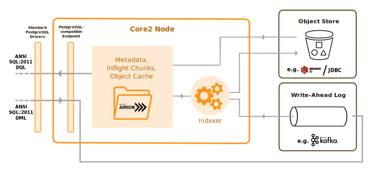

= XTDB '`Core2`' Research 🧪

Welcome to the XTDB research repository!

XTDB '`Core2`' is an experimental, SQL-first, immutable database concept.

== Vision

The technical aim is to implement https://en.wikipedia.org/wiki/SQL:2011#New_features[SQL:2011 temporal query capabilities] on top of immutable, columnar data storage.

Core2 implements a dynamic schema model (i.e. no explicit https://en.wikipedia.org/wiki/Data_definition_language[DDL] is required) and allows for relational querying across nested, document-shaped data.
Core2 embraces a https://xtdb.com/blog/dev-diary-may-22/#_pillar_1_sosac[separated-storage-and-compute] architecture, using https://arrow.apache.org/[Apache Arrow] as the underlying columnar data format.

Read more about Core2 in our https://xtdb.com/pdfs/vision-doc.pdf[Vision Document] (PDF).

== SQL:2011

All data in XTDB is https://en.wikipedia.org/wiki/Bitemporal_modeling[bitemporal data].
Core2 not only implements SQL:2011's bitemporal features, but makes those features much more practical and accessible to regular users.
Traditional concerns about awkward bitemporal schema migrations are avoided thanks to pervasive support for dynamic querying across polymorphic records.

SQL:2011 queries enable querying _across_ time.
For example, the following query asks "Which employees and contractors worked for the company at the same time?"

[source,sql]
----
SELECT employee.name, contractor.name
FROM employee, contractor
WHERE employee.application_time OVERLAPS contractor.application_time
----

== Warning

This is experimental software.

If you are looking for a stable release of an immutable document database with bitemporal query capabilities, we are continuing to develop and support XTDB 1.x here: https://github.com/xtdb/xtdb

== Hows does this differ from XTDB 1.x?

XTDB 1.x is a mature product offering that is used in production by many organizations, and its ongoing development is focused on hardening and performance.
XTDB 1.x is a https://en.wikipedia.org/wiki/Datalog[Datalog-first], embeddable database that emphasizes in-process JVM usage to enable advanced functionality like user-defined transaction functions, speculative transactions, programmatic Datalog rules, and more.

Core2's initial objective is to take the key principles embodied in XTDB 1.x -- immutability, schemaless records, and temporal querying -- to a mainstream SQL audience.

[cols=3*]
|===
| | XTDB 1.x | '`Core2`' Research Concept
| Status | Stable | Experimental (pre-alpha)
| Initial Stable Release | 2019 | TBD
| Primary Interface | Java + 'https://github.com/edn-format/edn[edn] Datalog' | SQL (https://github.com/xtdb/core2/blob/2d8791c653f58a3eb24c650967e781204dd22975/doc/adr/0038-pgwire.adoc[Postgres] native drivers, JDBC, https://github.com/xtdb/core2/blob/859baec8289289545aca842d320a5adc17f3c67b/doc/adr/0008-sql-support.adoc#protocols[etc.])
| Secondary Interface | OpenAPI, Calcite SQL (read-only) | 'edn Datalog' (https://github.com/xtdb/core2/blob/master/test/core2/datalog/datalog_test.clj[planned] once SQL is ~complete)
| Execution Model | Tuple-at-a-Time Sort-Merge Joins | Vectorized Relational Algebra
| Storage & Compute | Coupled (nodes are full replicas) | Separated (cost-effective scale out)
| Primary Storage Format | Custom Key-Value encodings | Columnar Apache Arrow
| Bitemporal Querying | Timeslice only ('as-of') | SQL:2011 and beyond
| Temporal Granularity | Milliseconds | Microseconds
| Relational Decorrelation | No | Yes
| Analytical Querying | No | Yes
| Single-partition Transaction Log | Infinite Retention | Ephemeral WAL
| Persistence Layer | Transaction Log + Document Store | Object Store
| Index Upgrades | Full log replay | Online
| - | - | -
| Immutable Semantics | Yes | Yes
| Online Transactions (ACID, linearizable consistency) | Yes | Yes
| Always-On Bitemporality | Yes | Yes
| Dynamism (ad-hoc graph joins, union typing, schemaless, etc.) | Yes | Yes
|===

== Quickstart

[source,sh]
----
docker pull xtdb/core2
docker run -p 5432:5432 xtdb/core2
----

You should see `hh:mm:ss | PGWire server started on port: 5432`.
You can now access that port from outside the Docker container:

[source,sh]
----
psql -h localhost
# as of this writing, DML is not supported over pgwire yet
----

If you would like to retain your data when the container reboots,
mount a volume to your running Docker image like so:

[source,sh]
----
docker run -p 5432:5432 -v /tmp/xtdb:/var/lib/xtdb xtdb/core2
----

=== Troubleshooting

Certain older versions of Docker (< 20.10.10) struggle with newer Linux images.
When that happens, you will see this error:

[source,sh]
----
# There is insufficient memory for the Java Runtime Environment to continue.
# Cannot create worker GC thread. Out of system resources.
----

To resolve this, upgrade to the latest version of Docker.

== Documentation

There is currently no official documentation for Core2 outside of the tests and source code in this repository. Please do not open issues on this repository with documentation-related questions at this stage.

== Questions, Thoughts & Feedback

We would love to hear from you: hello@xtdb.com

== License and Copyright

The Affero GNU Public License, Version 3.

Copyright © 2018-2022 JUXT LTD.
