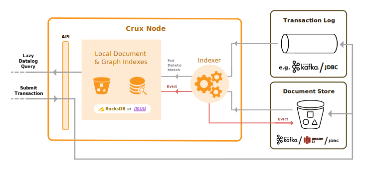
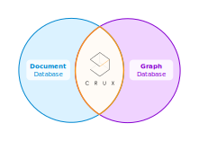

[](https://juxt-oss.zulipchat.com/#narrow/stream/194466-crux)

Crux is an open source document database with bitemporal graph queries. Java,
Clojure and HTTP APIs are provided.

Crux follows an _unbundled_ architectural approach, which means that it is
assembled from highly decoupled components through the use of semi-immutable
logs at the core of its design. Logs can currently be stored in LMDB or RocksDB
for standalone single-node deployments, or using Kafka for clustered
deployments. Indexes can currently be stored using LMDB or RocksDB.

Crux is built for efficient bitemporal indexing of schemaless documents, and
this simplicity enables broad possibilities for creating layered extensions on
top, such as to add additional transaction, query, and schema capabilities.
Crux does not currently support SQL but it does provide an EDN-based
[Datalog](https://en.wikipedia.org/wiki/Datalog) query interface that can be
used to express a comprehensive range of SQL-like join operations as well as
recursive graph traversals.

Crux has been available as a *Public Alpha* since 19<sup>th</sup> April 2019.

## CircleCI Build

[](https://circleci.com/gh/juxt/crux)

## Latest Release

[](https://clojars.org/juxt/crux-core)

## Unbundled Architecture

Crux embraces the transaction log as the central point of coordination when
running as a distributed system. Use of a separate document log enables simple
eviction of active and historical data to assist with technical compliance for
information privacy regulations.

> What do we have to gain from turning the database inside out? Simpler code,
> better scalability, better robustness, lower latency, and more flexibility for
> doing interesting things with data.
>
> — Martin Kleppmann



This design makes it feasible and desirable to embed Crux nodes directly in
your application processes, which reduces deployment complexity and eliminates
round-trip overheads when running complex application queries.

###

## Data Model



Crux is fundamentally a store of versioned EDN documents. The only requirement
is that you specify a valid `:crux.db/id` key which links the documents to
their corresponding entities. The fields within these documents are
automatically indexed as Entity-Attribute-Value triples to support efficient
graph queries. Document versions are indexed by `valid-time` (in addition to
`transaction-time`) which allows you to model updates into the past, present or
future.

Crux supports a Datalog query interface for reading data and traversing
relationships across all documents. Queries are executed so that the results
are lazily streamed from the underlying indexes. Queries can be made against
consistent point-in-time snapshots of your database from any Crux node
connected to the same transaction log, by specifying `transaction-time` and/or
`valid-time`.

## Documentation

Please visit our [official documentation](https://opencrux.com) to get started with Crux.

## Community & Contact

[](https://juxt-oss.zulipchat.com/#narrow/stream/194466-crux)

### 3rd Party Modules
* [avisi-apps/crux-xodus](https://github.com/avisi-apps/crux-xodus) - pure-JVM
  alternative to `crux-rocksdb` and `crux-lmdb`
* [avisi-apps/crux-active-objects](https://github.com/avisi-apps/crux-active-objects)
  - TxLog implementation backed by Active Objects for use inside Atlassian
    Addons

### Companies using Crux

* [Oscaro (eCommerce)](https://www.oscaro.com)
* [Avisi (AtlasCRM)](https://www.avisi.nl/blog/crux-our-final-database-migration) - ["Crux: Our Final Database Migration"](https://www.avisi.nl/blog/crux-our-final-database-migration)
* [Gnurdle (consulting)](https://gnurdle.github.io/HoppyResume2017.html)
* Yours? Let us know :)

crux@juxt.pro

## Repo Layout

Crux is split across multiple projects which are maintained within this
repository. `crux-core` contains the main functional components of Crux along
with interfaces for the pluggable storage components (Kafka, LMDB, RocksDB
etc.). Implementations of these storage options are located in their own
projects.

Project directories are published to Clojars independently so that you can
maintain granular dependencies on precisely the individual components needed
for your application.

### Core

#### crux-core

[](https://clojars.org/juxt/crux-core)

### Cluster Node storage

#### crux-kafka

For scalability and durability.

[](https://clojars.org/juxt/crux-kafka)

#### crux-kafka-embedded

Useful for experimentation and testing.

[](https://clojars.org/juxt/crux-kafka-embedded)

### Local KV and Standalone mode storage

#### crux-lmdb

Better read performance for intensive querying.

[](https://clojars.org/juxt/crux-lmdb)

#### crux-rocksdb

Better write performance for heavy ingestion.

[](https://clojars.org/juxt/crux-rocksdb)

`crux-rocksdb` is a good default choice.

### HTTP

#### Server

[](https://clojars.org/juxt/crux-http-server)

#### Client

[](https://clojars.org/juxt/crux-http-client)

### Additional

#### crux-rdf

Import RDF data and run a subset of SPARQL queries.

[](https://clojars.org/juxt/crux-rdf)

## Crux Labs

Have a look at the more experimental modules being developed over at [Crux Labs](https://github.com/crux-labs), such as [`crux-dataflow`](https://github.com/crux-labs/crux-dataflow) and the [`crux-console`](https://github.com/crux-labs/crux-console).

We will use Crux Labs as a place to test ideas and early module development, that may eventually be officially supported and migrated to the official Crux repository.

## Using Clojure

Please note that Clojure is not _required_ when using Crux. HTTP and Java
APIs are also available.

### REPL

Launch a REPL using the very latest Clojars `-SNAPSHOT` release:

``` sh
clj -Sdeps '{:deps {juxt/crux-core {:mvn/version "RELEASE"}}}'
```

Start a standalone in-memory (i.e. not persisted anywhere) node:

``` clojure
(require '[crux.api :as crux])
(import '[crux.api ICruxAPI])

(def my-node
  (crux/start-node
    ;; see 'configuration' section of docs for LMDB/RocksDB storage options
    {:crux.node/topology ['crux.standalone/topology]}))
```

`put` a document:

``` clojure
(def my-document
  {:crux.db/id :some/fancy-id
   :arbitrary-key ["an untyped value" 123]
   :nested-map {"and values" :can-be-arbitrarily-nested}})

(crux/submit-tx my-node [[:crux.tx/put my-document]])
```

Take an immutable snapshot of the database:

``` clojure
(def my-db (crux/db my-node))
```

Retrieve the current version of the document:

``` clojure
(crux/entity my-db :some/fancy-id)
```

### Developing Crux

* To run a REPL that includes dependencies for all components of Crux, first build the sub-modules using `lein sub install`.
* Start a REPL with `lein repl` (with `--headless` if you're just going to connect to it from your editor).
* Once you've connected to the REPL, in the `user` namespace, run:
  * `(go)` to start up the dev node
  * `(halt!)` to stop it
  * `(reset)` to stop it, reload changed namespaces, and restart it
  * `(reset-all)` to stop it, reload all namespaces, and restart it
  * if you're using Emacs/CIDER, `cider-ns-refresh` will do all this for you - `C-c M-n M-r`, `, s x` in Spacemacs
  * Conjure users can use `ConjureRefresh`, see the [docs](https://github.com/Olical/conjure#mappings) for bindings
  * see [Integrant REPL](https://github.com/weavejester/integrant-repl) for more details.
* You should now have a running Crux node under `(user/crux-node)` - you can verify this by calling `(crux/status (crux-node))` (in the `user` namespace).
* Most of the time, you shouldn't need to bounce the REPL, but:
  * if you add a module, or change any of the dependencies of any of the modules, that'll require another `lein sub install` and a REPL bounce
  * if you change any of the Java classes, that'll require a `lein sub javac` and a REPL bounce
  * otherwise, `(user/reset)` (or just `(reset)` if you're already in the `user` ns) should be sufficient.
* You can run module tests from the root of the git repo without a `lein sub install`, because of the lein checkouts - all of the tests are in scope here, so things like `lein test :only crux.tx-test` should also work.
* Please don't put any more side-effecting top-level code in dev namespaces - you'll break this reload ability and make me sad.

### Testing

The recommended way of running the full test suite is `lein build`.

The test suite relies on the `timeout` command line utility, this comes as a default on Linux but isn't preinstalled on MacOS. You can get it with `brew install coreutils && echo 'alias timeout=gtimeout' >> ~/.bashrc'`

## Copyright & License
The MIT License (MIT)

Copyright © 2018-2020 JUXT LTD.

Permission is hereby granted, free of charge, to any person obtaining a copy of
this software and associated documentation files (the "Software"), to deal in
the Software without restriction, including without limitation the rights to
use, copy, modify, merge, publish, distribute, sublicense, and/or sell copies
of the Software, and to permit persons to whom the Software is furnished to do
so, subject to the following conditions:

The above copyright notice and this permission notice shall be included in all
copies or substantial portions of the Software.

THE SOFTWARE IS PROVIDED "AS IS", WITHOUT WARRANTY OF ANY KIND, EXPRESS OR
IMPLIED, INCLUDING BUT NOT LIMITED TO THE WARRANTIES OF MERCHANTABILITY,
FITNESS FOR A PARTICULAR PURPOSE AND NONINFRINGEMENT. IN NO EVENT SHALL THE
AUTHORS OR COPYRIGHT HOLDERS BE LIABLE FOR ANY CLAIM, DAMAGES OR OTHER
LIABILITY, WHETHER IN AN ACTION OF CONTRACT, TORT OR OTHERWISE, ARISING FROM,
OUT OF OR IN CONNECTION WITH THE SOFTWARE OR THE USE OR OTHER DEALINGS IN THE
SOFTWARE.

### Dependencies

A list of compiled dependencies and corresponding licenses is available
[here](LICENSE-deps.adoc).
