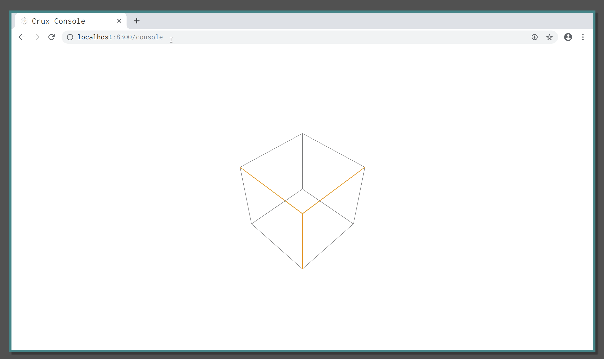

= Get Started
:experimental:

== Introduction

Crux console is a single page application which is able to interact with a crux
node, sending and receiving queries, and then displaying the resulting in
tables or graphs. This guide will walk though how to get the most out of this
application including setup and usage. This guild is not to teach how to use
crux, but to give an demonstration about how crux can be used.

TODO is it?

== Installation

If you are just looking to test out the functionality of this tool you can skip
this step and go to <<Usage>> Currently however this uses
the same crux node for all users, so if you notice items in the database
changing, someone else could be also using console at the same time.
If you want to start with an empty database for the moment you'll have to build
and run your own local version.

=== Building crux

[source, shell]
----
$ cd crux
$ lein sub install
----

=== Running console

[source, shell]
----
$ cd crux/crux-console
$ lein cljs-dev
$ # In a different terminal
$ lein repl
----

This will run `console` at http://localhost:8300.

== Usage

This section will cover how to get the most out of console by playing around
with some data.

Once you open console you should be greeted by 2 panels. The one on the left
can be given input to send to the crux node. The panel on the right displays
the input received using various graphics. Initially the input panel will have
a default query:

[source, clojure]
----
{:find [e]
 :where
 [[e :crux.db/id _]]
; options
 :full-results? true}
----

`console` is able to detect the desired use of the input and assign it the
relevant function. As we have a query in the format of a `crux.api/q`,
`console` identifies this and labels it in the top right of the input panel as
_query_.
When we click *Run Query* with this argument we should receive all
the elements in our crux node and this result should display in the right
panel. When running console locally we should see a _Query succeeded! Zero
results._ message. This is because we have not yet entered any data into our
database, do lets just do that now (if using the cloud version its more than
likely that you'll see some data but lets ignore that for now).

=== Adding some data

In order to get some data in our node to play around with we've provided you
with some sample queries to use. In the bottom of the left panel you'll see a
list of example queries. Click on the one labeled `:crux.tx/put`. This will
insert some text into the input panel. The format of this determines that the
input is some transaction. When `console` recognises this it places a `tx` in
the top right of the input panel (note that with the previous input it had
`query` in the top right). This query will add some mock data giving a list of
stock ticker prices and the locations of their associated exchanges.  Once we
run this, we receive some output on the output panel it should looks something
like this:

[source, clojure]
----
{:crux.tx/tx-id	1606996128814081
 :crux.tx/tx-time	#inst "2019-09-24T13:35:57.045-00:00"}
----

This is the id of the transaction you just made to the database and the time
you made it at. The same result you would get if running `crux` in a repl. Lets
run that first query again to see if it works. Click on the example query _full
results_ and then press kbd:[Ctrl + Enter].

This should give you a load of output including ticker prices and stock
exchange locations. We'll cover what that query did and adding data with
specific `valid-time` and `tx-time` later in <<Adding more data>> but don't
worry about that for now.

=== Basic Queries/Analysis

The previous query gave us every thing currently stored in crux but lets filter
out some stuff so we can get a better idea about what we have in here. Click on
the simple query snippet. This will give you this query:

[source, clojure]
----
{:find [e p]
 :where
 [[e :crux.db/id _]
  [e :ticker/price p]]}
----
TODO: this query is too verbose - `[e :crux.db/id _]` does nothing

NOTE: The query could also be written as `{:find [i p] :where [[e :crux.db/id
i] [e :ticker/price p]]}` i.e. where we explicitly ask for the `crux.db/id`. In
this case, e displays the same text as i.

This returns all entries with an ticker price of p and their respective entry
id. We can see on the bottom left of the display panel we have received 50
different results. This seems still a bit too much for us to parse. As I'm a
bit out of pocket at the moment lets only display tickers that are under 30
units (TODO what are they? $?). Add `[(< p 30)]` as another vector to the
`:where` clause.

This gives us just 12 results to look through. That's a bit more manageable.

=== Adding more data

Lets now see how console is able to display some temporal results. Stock prices
are perfect for this but our current data only has one entry. So lets add some
more. Click on the _put with vaild time_ example.

Like last time we used put we get a 2 element map back with the transaction id
and time. If we run the _simple query_ example again it looks like we only have
1 extra entry. In space, that's true but in time we have just entered an entire
stocks history. If you scroll through the results of the query you should see
an entry with a decimal value. Click on the entries id.

Clicking on an entity lists out all of the its data. In this case you should
see `:crux.db/id`, `:ticker.price`, and `:ticker/market`. Don't worry about if
your example doesn't match ours this example is randomly generated to produce
random stock data (TODO: should it? it is cool but probably not needed for an
example). In order to get an idea how the price of this has changed through
time click the attribute history tab at the bottom of the display panel.

This should give you a lovely looking visualisation, something like ours.
Running your mouse pointer along the graph gives you details about the state of
the entry as time has passed.
