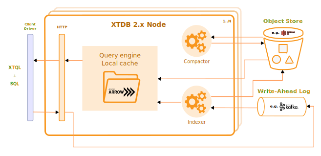

= A high-level tour of the XTDB codebase

:written: 2024-10-29
:reviewed: 2024-10-29

The aim of this document isn't to be in any way _complete_ - more as a guide on where to start looking!

]

Initial notes:

* There are currently three ways of accessing an XTDB node, all of which use the same transaction lifecycle:
** 'pgwire' - a PostgreSQL wire-compatible server (preferred)
** In-process Clojure-only API
** HTTP (https://github.com/cognitect/transit-format[Transit^]) API
* XTDB has two 'golden stores' - the log and the object-store.
  XTDB nodes do not currently communicate with each other except through these external services.
  Hence, they _must_ agree on the contents of any shared files - i.e. the process to create the files (even the decision of _when_ to cut a file) must be entirely deterministic.
* The overall aim of the nodes in the XTDB cluster is to maintain a performant primary index for each table in the object-store.
  This primary index is an https://en.wikipedia.org/wiki/Log-structured_merge-tree[LSM tree^] of 'events' (puts, deletes and erases), sorted first by IID (a 16-byte representation of the entity's primary key), then system-time descending, written in https://arrow.apache.org[Apache Arrow^] files.
+
Each event simply contains the IID of the entity, the system-time of the event, the user-specified valid-time range (for puts/deletes), and the document (for puts) - so N.B. 'system-to' is not stored here, nor the effective valid-time range - they are derived from subsequent events through 'bitemporal resolution'.
+
On query, we then merge-sort the individual files of the LSM tree to re-construct the bitemporal history for each entity.
* XTDB is https://jepsen.io/consistency['strictly serializable'^] - both that updates to entities appear to have a total ordering, and that reads observe all previous successful writes.

== The lifecycle of a transaction

1. *Clients submit transactions to any XTDB node*
+
--
(see `xtdb.log`)

Transactions in XTDB are fundamentally asynchronous and non-interactive.
Transaction 'operations' (e.g. put-docs, delete-docs, or a SQL query) are buffered into an atomic transaction as required, serialised into Arrow format, and submitted to the log.

The client receives a 'ticket' containing the tx-id (essentially a log sequence number) and system-time of the transaction, which it later provides on query to ensure it observes the results of the submitted transactions.
--
2. *XTDB nodes continually index the log*
+
--
(see `xtdb.indexer`, `xtdb.live-index`)

XTDB nodes read transactions from the log, evaluate them if required, and upload blocks of transactions (~100k rows) as files to the object store.
These block files form the lowest level (L0) of the LSM tree.

Before transactions are included in a block, they are held in the 'live index', which is included as part of queries' input sets, so that queries can observe recent transactions.

The live-index is in-memory - so, when they start up, XTDB nodes check the latest transaction written as part of a block in the object store and start consuming the log from there.
--
3. *In the background, the compactors on each node share the compaction of the LSM tree*
+
--
(see `xtdb.compactor`)

This, strictly speaking, is an optional process - queries will return correct results without it just by reading the L0 files uploaded by the indexers.

Without the compactors, though, the performance would likely be terrible - the query engine would have to merge-sort all of the L0 files at the same time.
Compaction, essentially, is pre-computing as much of this merge-sort as possible so that each individual query only has to read as much data as is strictly necessary.

1. L0 files are first compacted into L1 files - the aim of this is to coalesce smaller L0 files together so that the rest of the tree contains files of a consistent size (~100MB, in practice).
2. L1 files are then compacted into L2 files - at this point, we begin the process of partitioning files based on the IIDs of the events they contain.
   We use a branching factor of four, so four L1 files (a 'run') potentially containing events for any IID are combined into four L2 files, each known to contain only a subset of the events - so for each group of four L1 files there'll be one L2 file for the bit-prefix '00', one for '01', '10' and '11'.
3. This then continues up the tree - so once there've been 16 L1 files, there will be four '00' L2 files, which themselves are compacted into four L3 files: '0000', '0001', '0010' and '0011'.
   L4 uses six bits of prefix, L5 eight, etc.

Unlike the indexers (which compete to write the L0 files), the compactors share the work of compacting the LSM tree - again, without communication save for through the golden stores.
Here, though, there is plenty of work to go around - because each compaction task is relatively fine-grained, and the compactors pick up work at random, there is a sufficiently low chance of compactors picking the same task at the same time.
--
4. *Queries combine the LSM tree and the live-index to serve query results*
+
This is a lifecycle in itself 😃

== The lifecycle of a query

The user submits a query to any XTDB node.

They (optionally) provide system-time bounds to control what data is visible to the query, either:

* a `snapshot-time` - an exact bound on the system-time.
  This is used to ensure query repeatability, to replay an earlier query.
* an 'after-tx-id' - a lower-bound on the transaction indexed.
This is used to ensure that queries observe earlier-submitted transactions - indeed, this argument ensures the read-your-writes aspect of the 'strict serialisable' guarantee.

When the query is submitted:

1. It is first *parsed into an https://en.wikipedia.org/wiki/Abstract_syntax_tree[AST]* - for SQL, using https://www.antlr.org[Antlr]; for XTQL, using a hand-rolled parser.
+
--
(see `Sql.g4`, `xtdb.xtql`)
--
2. *The AST is transformed into a naïve 'logical plan'*.
+
--
(see `xtdb.sql.plan`, `xtdb.xtql`)

Logical plans are expressed in terms of https://en.wikipedia.org/wiki/Relational_algebra[relational algebra] operators.
These compose to form an execution pipeline, with each operator accepting 0..N input relations and returning an output relation.

For example:

* `:scan` - a zero-input source operator that reads the LSM.
* `:table` - another source operator that just outputs a literal relation.
* `:select` - an intermediate operator that filters its input using a given predicate.
* `:project` - an intermediate operator that creates new columns based on input columns.
* `:order-by`, `:group-by` - more hopefully self-explanatory 1-arg intermediate operators.
* `:join`, `:left-outer-join`, `:semi-join` - intermediate operators that accept two input relations and join them using given join conditions.

The initial logical plan generated by the SQL and XTQL planners are only intended to be correct, not necessarily performant - the simplest plan we can generate from the given AST.

Additionally, both XTQL and SQL plan to this same structure, which means that below this point they follow the same code-path.
--
3. *The naïve logical plan is optimised through repeated application of optimisation rules*
+
--
(see `xtdb.logical-plan`)

We then repeatedly transform the logical plan using a number of small, incremental rules, each of which is an equivalence transformation - i.e. it returns the same results, but (hopefully) faster.
We keep applying rules until the query plan no longer changes (a 'fixpoint').
Each of these rules is a local pattern match on the structure of the query plan - it tries to identify a pattern of operators, checks to see whether any constraints on the rules hold, then applies the replacement.

These rules are split into two categories: rules that mostly involve making joins more efficient, and decorrelation rules.

In the naïve planner, we make no attempt to combine joins with join conditions - they're often planned as a cross-join followed by a separate select operator.
Here, though, we try to combine these together, so that we filter as we're joining rather than materialising a full Cartesian product of the two input relations before we filter it down.
For example, a couple of rules in this area:

- If we see a `:select` immediately containing a `:join` or `:cross-join`, we move the `:select` predicate within the join, as a join condition.
- If we see a `:select` immediately containing a `:join` and the predicate only contains fields from one side of the join, we move the `:select` onto the input relation of the join (e.g. `[:select pred [:join join-cond rel-a rel-b]]` -> `[:join join-cond rel-a [:select pred rel-b]]`)

Separately, we consider *'decorrelation'*.

SQL allows 'correlated' subqueries - subqueries which refer to columns in the containing query:

[source,sql]
----
SELECT foo.a
FROM foo
WHERE EXISTS (SELECT 1 FROM bar WHERE bar._id = foo.bar)
----

Naïvely, we plan these using an `:apply` operator - a nested loop join.
This (in line with the assertions above) returns correct but slow results:

1. it first scans `foo`
2. then, for every row in `foo`, it executes the sub-query.

Decorrelation rules attempt to replace this N+1 query plan with a query plan that (in this case):

1. evaluates the RHS once, building a hash-map
2. evaluates the LHS once, filtering using said hash-map.
--
4. *The optimised query plan is executed*
+
--
Execution of a query plan is a pull-based pipeline of relational operators - the outermost operator pulling pages of rows (all in Arrow format) from its input relations, all the way down to the source operators.

Because the query plan forms an https://en.wikipedia.org/wiki/Abstract_algebra[algebra^], each of the operators can be reasoned about relatively independently.

A few notes on the individual operators:

* The `:scan` operator (`xtdb.operator.scan`) is easily the most complex operator - it's (directly/indirectly) responsible for choosing which files to read, reading those files, merge-sorting those pages (together with the live-index) and applying 'bitemporal resolution' to re-construct the current state of the given entities.
** After every transaction, the indexer takes a 'watermark' of the current state of the live index, allowing it to be read by queries concurrently to new transactions being indexed.
** 'Bitemporal resolution' is the process by which the scan operator reduces a system-time descending list of events for each entity into the actual history relevant to the query.
At this point, system-time-descending is a useful ordering - for as-of-now queries, we can usually skip all bar the most recent event for each entity.

+
After the scan operator, the relation is known to only contains rows which are valid at the time of the query.
* The `:project` and `:select` operators both contain 'expressions' to be evaluated.
These expressions are compiled into Clojure 'kernels' - forms which, when compiled (using `eval`) and executed, efficiently apply the given calculation to a vector of values.
+
(see `xtdb.expression`)

The results from the outermost operator are then deserialised from Arrow format into the appropriate output format for the user.
--
