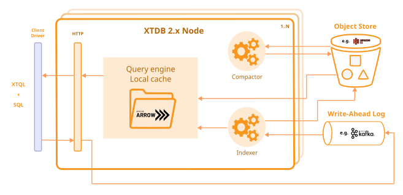

= A high-level tour of the XTDB codebase

:written: 2024-10-29
:reviewed: 2026-04-20

The aim of this document isn't to be in any way _complete_ - more as a guide on where to start looking!

]

Initial notes:

* There are currently two ways of accessing an XTDB node, all of which use the same transaction lifecycle:
** 'pgwire' - a PostgreSQL wire-compatible server (preferred)
** In-process Clojure-only API - this now talks over pgwire too.
* XTDB has two 'golden stores' - the log and the object-store.
  XTDB nodes do not currently communicate with each other except through these external services.
  Indexing is coordinated by electing a single leader per database (see 'Leader election and handover' below); compactors, by contrast, run on every node and must produce byte-identical files, because multiple compactors may independently pick up the same task.
* The overall aim of the nodes in the XTDB cluster is to maintain a performant primary index for each table in the object-store.
  This primary index is an https://en.wikipedia.org/wiki/Log-structured_merge-tree[LSM tree^] of 'events' (puts, deletes and erases), sorted first by IID (a 16-byte representation of the entity's primary key), then system-time descending, written in https://arrow.apache.org[Apache Arrow^] files.
+
Each event simply contains the IID of the entity, the system-time of the event, the user-specified valid-time range (for puts/deletes), and the document (for puts) - so N.B. 'system-to' is not stored here, nor the effective valid-time range - they are derived from subsequent events through 'bitemporal resolution'.
+
On query, we then merge-sort the individual files of the LSM tree to re-construct the bitemporal history for each entity.
* XTDB is https://jepsen.io/consistency['strictly serializable'^] - both that updates to entities appear to have a total ordering, and that reads observe all previous successful writes.

== Layering: storage, state and services

A hexagonal-inspired split that most of the indexing/storage side of the codebase follows.
It's a useful lens for placing a new class, and for spotting one that's ended up doing two jobs.

Storage - the I/O layer::
`BufferPool` (`xtdb.storage`, with `RemoteBufferPool`/`LocalStorage`/`MemoryStorage` behind it), `ObjectStore` (`xtdb.api.storage`), `Log<M>` (`xtdb.api.log`), and `PageMetadata` (`xtdb.metadata`) - a read-through cache over the buffer pool.

State - in-memory state holders::
`BlockCatalog` and `TableCatalog` (`xtdb.catalog`), `TrieCatalog` (interface in `xtdb.trie`, implemented in `xtdb.trie-catalog`), and `LiveIndex` (`xtdb.indexer`).

Services - orchestration::
`LogProcessor` and its three role implementations, `BlockUploader` and `CrashLogger` (`xtdb.indexer`); `Compactor` (`xtdb.compactor`); `BlockGarbageCollector` and `TrieGarbageCollector` (`xtdb.garbage-collector`); and `DatabaseCatalog` (`xtdb.database` - a service despite the name, managing database attach/detach and lifecycle).

Dependencies flow inward: services depend on state and on storage; state depends on neither.
State components *yield* data and the service does the I/O - `LiveIndex.finishBlock` takes a `BufferPool` as a call parameter rather than holding one, and it's `BlockUploader` (which does hold one) that supplies it and writes the resulting files.
That's 'functional core, imperative shell' in OO vocabulary.

`PartitionState` and `PartitionStorage` (`xtdb.database`) state the split most explicitly: the former bundles the four state holders, the latter the buffer pool, the source/replica logs and the page-metadata factory.

Two caveats, so you don't read more into this than is there:

* *It isn't a package boundary.*
  `xtdb.catalog`, `xtdb.compactor` and `xtdb.garbage-collector` are clean, but `xtdb.indexer` holds `LiveIndex` (state) alongside the log processors and `BlockUploader` (services), and `xtdb.trie` holds the `TrieCatalog` interface alongside the trie/data/metadata file writers.
* *`TableCatalog` keeps a `BufferPool` for its lifetime*, unlike `BlockCatalog` (which takes none) and `TrieCatalog` (whose I/O sits in the factory).
  It's only used by `refresh`, called once from `PartitionState.open` at startup - so 'state does no runtime I/O' holds here by convention rather than by construction.

== The lifecycle of a transaction

1. *Clients submit transactions to any XTDB node*
+
--
(see `xtdb.log`)

Transactions in XTDB are fundamentally asynchronous and non-interactive.
Transaction 'operations' (e.g. put-docs, delete-docs, or a SQL query) are buffered into an atomic transaction as required, serialised into Arrow format, and submitted to the log.

The client receives a 'ticket' containing the tx-id (essentially a log sequence number) and system-time of the transaction, which it later provides on query to ensure it observes the results of the submitted transactions.

*SQL DML is expanded eagerly, at submit time, wherever we can manage it* - rather than submitting a raw `TxOp.Sql` and re-planning it on every node at index time.
`Xtdb.Connection.expandStaticOps` runs each op through `SqlPlanner.toStaticOps` (implemented by `xtdb.sql/->sql-planner` over `sql->static-ops`), which turns INSERT and PATCH into core `TxOp.PutDocs`/`TxOp.PatchDocs`.
Statements we can't expand statically - UPDATE, DELETE, ERASE, and the non-DML remainder - return `nil` from the planner, and the caller keeps the raw `TxOp.Sql`.

There are two submit points, both going through `expandStaticOps`: the manual-tx drain (`drainWriteTx`) and the autocommit `executeTxOp`.
Every frontend funnels through them - pgwire's `executeUpdate`, the ADBC batch path in `xtdb.adbc`, Flight SQL - so there is one expansion path rather than one per frontend.
That matters beyond the saved work: expanding at submit time means malformed DML is rejected by the planner, with a planner error, at the point the client submits it, rather than surfacing later as a generic indexer failure.
Before the drain, the connection's `DmlBuffer` coalesces consecutive same-SQL ops, appending their args into the last op's relation, so a prepared INSERT in a loop becomes a single multi-row op.
--
2. *A single leader per database indexes the source log*
+
--
(see `xtdb.indexer`, `xtdb.live-index`)

Each database has two logs (separate Kafka topics, single-partition each):

* the *source log* (`SourceMessage`) — the durable queue that clients submit to.
  Many writers; no ordering constraints beyond Kafka's.
* the *replica log* (`ReplicaMessage`) — the leader's output.
  It carries already-resolved transactions (with tx-ids, system-times, and tries ready to be included in a block), plus block boundaries and trie-added notifications.
  Only the current leader writes to it.

All indexer nodes in the cluster join a consumer group on the source log.
Whichever node gets assigned the partition becomes the *leader* for that database; the others are *followers*.
Kafka's consumer-group rebalance protocol drives the handover when a leader dies or a new node joins.

The leader consumes each `SourceMessage`, evaluates the transaction if required, indexes it into its live index, and appends the resulting `ReplicaMessage` to the replica log.
It also uploads blocks of transactions (~100k rows) as files to the object store — these block files form the lowest level (L0) of the LSM tree.
Followers tail the replica log (not the source log) and apply each `ReplicaMessage` to their own live indexes.

Before transactions are included in a block, they are held in the 'live index', which is included as part of queries' input sets, so that queries can observe recent transactions.
The live-index is in-memory — so, when they start up, XTDB nodes check the latest transaction written as part of a block in the object store and start consuming the replica log from there.
--
3. *In the background, the compactors on each node share the compaction of the LSM tree*
+
--
(see `xtdb.compactor`)

This, strictly speaking, is an optional process - queries will return correct results without it just by reading the L0 files uploaded by the indexers.

Without the compactors, though, the performance would likely be terrible - the query engine would have to merge-sort all of the L0 files at the same time.
Compaction, essentially, is pre-computing as much of this merge-sort as possible so that each individual query only has to read as much data as is strictly necessary.

1. L0 files are first compacted into L1 files - the aim of this is to coalesce smaller L0 files together so that the rest of the tree contains files of a consistent size (~100MB, in practice).
2. L1 files are then compacted into L2 files - at this point, we begin the process of partitioning files based on the IIDs of the events they contain.
   We use a branching factor of four, so four L1 files (a 'run') potentially containing events for any IID are combined into four L2 files, each known to contain only a subset of the events - so for each group of four L1 files there'll be one L2 file for the bit-prefix '00', one for '01', '10' and '11'.
3. This then continues up the tree - so once there've been 16 L1 files, there will be four '00' L2 files, which themselves are compacted into four L3 files: '0000', '0001', '0010' and '0011'.
   L4 uses six bits of prefix, L5 eight, etc.

Unlike the indexers — where a single leader writes L0 files for each database — the compactors share the work of compacting the LSM tree across all nodes, again without communication save for through the golden stores.
There is plenty of work to go around: because each compaction task is relatively fine-grained, and the compactors pick up work at random, there is a sufficiently low chance of compactors picking the same task at the same time.
If two compactors _do_ pick the same task, that's fine: compaction output is deterministic, so they produce byte-identical files — only the wasted CPU is lost.
--
4. *Queries combine the LSM tree and the live-index to serve query results*
+
This is a lifecycle in itself 😃

== Leader election and handover

(see `xtdb.indexer.LogProcessor`, `xtdb.api.log.Watchers`)

Leadership is elected via Kafka consumer-group rebalancing — the standard Kafka protocol, no XTDB-level machinery on top.
Every indexer subscribes to the source-log topic; whichever node gets assigned the partition is the leader.
When the current leader stops heartbeating (crash, network partition, long GC pause) or a new node joins, Kafka triggers a rebalance and the partition assignment moves.

Leaders are *fenced* by term (a Raft-ReadIndex-style check), not by Kafka transactions.
Each record a leader writes to the replica log is stamped with its *term* — the Kafka consumer-group generation, which strictly increases every rebalance.
A leader applies and acknowledges a write only after it has read that write back from the replica log at its own term, with no higher-term record ahead of it; a superseded leader reads a higher-term record back, recognises it, and resigns without acknowledging its unconfirmed writes.
So at most one leader's writes are ever confirmed for a database, without relying on Kafka's transactional producer.

=== Three LogProcessor states

`xtdb.indexer.LogProcessor` is a small state machine, driven by the transport through three `Log.SubscriptionListener` operations — `launchTransition`, `commitLeader`, `demoteLeader`:

Follower (`FollowerLogProcessor`)::
The default state for a node that isn't currently leader.
Tails the replica log and applies each `ReplicaMessage` to its live index.
It does not consume the source log at all.

Leader (`LeaderLogProcessor`)::
Consumes the source log via the consumer-group subscription, resolves each transaction, appends the resulting `ReplicaMessage` to the replica log, and indexes it once it reads that message back at its own term.
Only the leader writes L0 files to the object store.

Transition (`TransitionLogProcessor`)::
An ephemeral state entered during follower→leader promotion.
The incoming leader may have a partially-filled in-memory block (from its time as a follower) that is not yet reflected on the replica log — the previous leader died before flushing it.
The transition processor finishes that pending block — uploading it to the object store and replaying the buffered records through the leader's pipeline — before the leader starts accepting new source-log messages.
This keeps the replica log the single source of truth for what's committed: by the time `LeaderLogProcessor` starts, the replica log agrees with what every follower has in its live index.

=== Watchers and poisoning

Each database has a `Watchers` (`xtdb.api.log.Watchers`) — a small state holder that tracks the latest processed source-msg-id, tx-id, and external-source token.
Clients' `awaitTx` / `awaitSource` calls suspend on it.

`Watchers` has two states: active, and failed (poisoned).
Once poisoned, every call raises the stored `IngestionStoppedException` — no further progress is observable on this node.

Poisoning happens when the node reaches an unrecoverable state.
The important case is failure *during* follower→leader transition: if we've started writing to the replica log but can't finish the handover, the node's in-memory state may have diverged from what's been durably committed.
Rather than continue with divergent state, we poison the watchers and let the node be restarted — it rebuilds its live index from the latest persisted block and catches up from the replica log.

== External-source databases

Some databases aren't fed by client `submitTx` at all — they mirror an external system via CDC (e.g. Postgres logical replication).

There's no separate processor for these: an `ExternalSource` is an optional collaborator of `LeaderLogProcessor`, which implements `ExternalSource.TxIndexer` itself and hands that to the source on partition assignment.
Flush, tries and block coordination are identical either way, and the leader still consumes the source log for them.
The differences are confined to where a transaction enters and how its tx-id is assigned:

* *tx-ids come from the leader, not the source log*.
  They're assigned off the resolver's *resolved* head (`TxResolver.latestCompletedTx` + 1) rather than derived from source-log msg-ids.
  Note this is the resolved head, not the durable one — resolution runs ahead of durability, so taking it from the live index would re-use a tx-id for every tx still in flight.
* *client `submitTx` is rejected* on external-source DBs with error code `xtdb/submit-tx-to-external-source-db` — users must submit through the external source instead.
  The check is on the *database's* configured source, not on whether this node happens to lead it, because the source log is shared and every node's submit path has to answer the same way.
* *the source drives ingestion* through `TxIndexer`, per-tx: smooth the system-time, open an `OpenTx`, let the source populate it, add the `xt/txs` row, then stage it on the resolver and hand it to the append pump.
  'Smoothing' nudges the system-time forward as needed to keep it strictly monotonic — upstream sources don't always guarantee that, but XTDB requires it.
  This is also how CDC sources get to choose tx metadata (including `userMetadata`) after seeing the transaction rather than before.
* *durability is confirmed on read-back*, not at append.
  `executeTx` awaits a per-tx handle that completes only when the leader reads that tx back at its own term — durably replicated *and* confirmed unfenced.
  `submitTx` returns the handle without awaiting it.
  Every path on which the tx will never be applied has to fail the handle instead, or the caller waits forever.
* *external-source tokens* (e.g. a Postgres LSN) are carried in the replica log alongside each tx, so on restart the source can resume from the last durably-indexed position — see `ExternalSourceToken` and the `afterToken` argument on `ExternalSource.onPartitionAssigned`.

Followers of an external-source database work exactly as above — they tail the replica log and apply `ReplicaMessage`s.
They have no visibility into the upstream CDC source at all.

== The lifecycle of a query

The user submits a query to any XTDB node.

They (optionally) provide system-time bounds to control what data is visible to the query, either:

* a `snapshot-token` - an exact bound on the transactions visible to the query.
  This is used to ensure query repeatability, to replay an earlier query.
* an 'await-token' - a lower-bound on the transaction indexed.
This is used to ensure that queries observe earlier-submitted transactions - indeed, this argument ensures the read-your-writes aspect of the 'strict serialisable' guarantee.

When the query is submitted:

1. It is first *parsed into an https://en.wikipedia.org/wiki/Abstract_syntax_tree[AST]* - for SQL, using https://www.antlr.org[Antlr]; for XTQL, using a hand-rolled parser.
+
--
(see `Sql.g4`, `xtdb.xtql`)
--
2. *The AST is transformed into a naïve 'logical plan'*.
+
--
(see `xtdb.sql.plan`, `xtdb.xtql`)

Logical plans are expressed in terms of https://en.wikipedia.org/wiki/Relational_algebra[relational algebra] operators.
These compose to form an execution pipeline, with each operator accepting 0..N input relations and returning an output relation.

For example:

* `:scan` - a zero-input source operator that reads the LSM.
* `:table` - another source operator that just outputs a literal relation.
* `:select` - an intermediate operator that filters its input using a given predicate.
* `:project` - an intermediate operator that creates new columns based on input columns.
* `:order-by`, `:group-by` - more hopefully self-explanatory 1-arg intermediate operators.
* `:join`, `:left-outer-join`, `:semi-join` - intermediate operators that accept two input relations and join them using given join conditions.

The initial logical plan generated by the SQL and XTQL planners are only intended to be correct, not necessarily performant - the simplest plan we can generate from the given AST.

Additionally, both XTQL and SQL plan to this same structure, which means that below this point they follow the same code-path.
--
3. *The naïve logical plan is optimised through repeated application of optimisation rules*
+
--
(see `xtdb.logical-plan`)

We then repeatedly transform the logical plan using a number of small, incremental rules, each of which is an equivalence transformation - i.e. it returns the same results, but (hopefully) faster.
We keep applying rules until the query plan no longer changes (a 'fixpoint').
Each of these rules is a local pattern match on the structure of the query plan - it tries to identify a pattern of operators, checks to see whether any constraints on the rules hold, then applies the replacement.

These rules are split into two categories: rules that mostly involve making joins more efficient, and decorrelation rules.

In the naïve planner, we make no attempt to combine joins with join conditions - they're often planned as a cross-join followed by a separate select operator.
Here, though, we try to combine these together, so that we filter as we're joining rather than materialising a full Cartesian product of the two input relations before we filter it down.
For example, a couple of rules in this area:

- If we see a `:select` immediately containing a `:join` or `:cross-join`, we move the `:select` predicate within the join, as a join condition.
- If we see a `:select` immediately containing a `:join` and the predicate only contains fields from one side of the join, we move the `:select` onto the input relation of the join (e.g. `[:select pred [:join join-cond rel-a rel-b]]` -> `[:join join-cond rel-a [:select pred rel-b]]`)

Separately, we consider *'decorrelation'*.

SQL allows 'correlated' subqueries - subqueries which refer to columns in the containing query:

[source,sql]
----
SELECT foo.a
FROM foo
WHERE EXISTS (SELECT 1 FROM bar WHERE bar._id = foo.bar)
----

Naïvely, we plan these using an `:apply` operator - a nested loop join.
This (in line with the assertions above) returns correct but slow results:

1. it first scans `foo`
2. then, for every row in `foo`, it executes the sub-query.

Decorrelation rules attempt to replace this N+1 query plan with a query plan that (in this case):

1. evaluates the RHS once, building a hash-map
2. evaluates the LHS once, filtering using said hash-map.
--
4. *The optimised query plan is executed*
+
--
Execution of a query plan is a pull-based pipeline of relational operators - the outermost operator pulling pages of rows (all in Arrow format) from its input relations, all the way down to the source operators.

Because the query plan forms an https://en.wikipedia.org/wiki/Abstract_algebra[algebra^], each of the operators can be reasoned about relatively independently.

A few notes on the individual operators:

* The `:scan` operator (`xtdb.operator.scan`) is easily the most complex operator - it's (directly/indirectly) responsible for choosing which files to read, reading those files, merge-sorting those pages (together with the live-index) and applying 'bitemporal resolution' to re-construct the current state of the given entities.
** After every transaction, the indexer takes a 'snapshot' of the current state of the live index, allowing it to be read by queries concurrently to new transactions being indexed.
** 'Bitemporal resolution' is the process by which the scan operator reduces a system-time descending list of events for each entity into the actual history relevant to the query.
At this point, system-time-descending is a useful ordering - for as-of-now queries, we can usually skip all bar the most recent event for each entity.

+
After the scan operator, the relation is known to contain only rows which are valid at the time of the query.
* The `:project` and `:select` operators both contain 'expressions' to be evaluated.
These expressions are compiled into Clojure 'kernels' - forms which, when compiled (using `eval`) and executed, efficiently apply the given calculation to a vector of values.
+
(see `xtdb.expression`)

The results from the outermost operator are then deserialised from Arrow format into the appropriate output format for the user.
--

=== Two decode paths, held in agreement by hand

`xt/q` dispatches on what you pass it (`xtdb.protocols/Connectable`), and the two impls decode results by completely different routes:

* an `Xtdb` node or `Xtdb$Connection` reads *in-process*, decoding Arrow directly - `xtdb.adbc/plan-q`, via `RelationReader.toMaps`;
* a `DataSource`/`java.sql.Connection` - including an `xt/client` against a remote node - goes over pgwire and next.jdbc, via `xtdb.next.jdbc/builder-fn`.

The two are *made* to agree; they don't agree for free.
The Arrow decode yields `java.util` collections, so `xtdb.adbc/reduce-page` walks every row through `xtdb.util/->clj`, and the JDBC builder does the equivalent walk on its side - both so that results compare `=` and hash the same whichever way you queried.

The hazard when you touch either path is that a divergence is close to invisible: two values can print identically and still fail `=`, because the difference is in the type rather than the rendering (a `ZonedDateTime` carrying `ZoneId "UTC"` against one carrying the `ZoneOffset` `Z`, say, or a numeric width).
Assert equality against a literal, not against a re-printed string.
