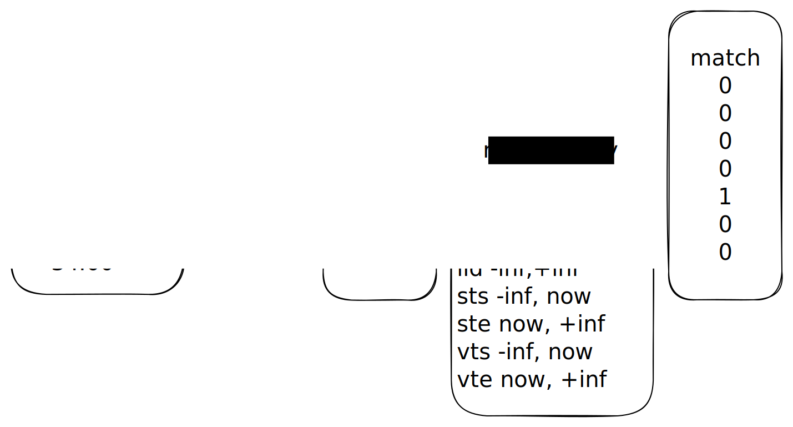
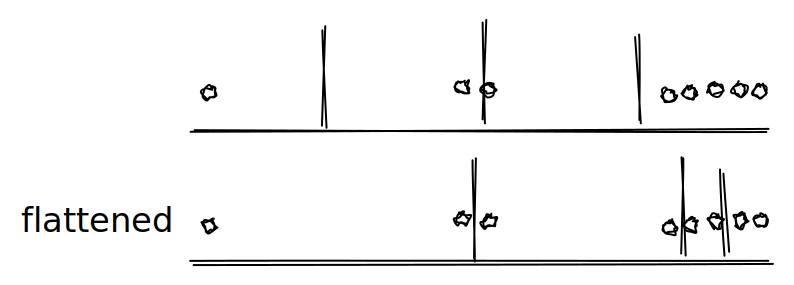

# Temporal

To answer queries in XTDB you apply filters to both user-defined `content` attributes, such as a persons `:name` or `:age`, but also to `temporal` attributes, such as valid start and end.

A user is more likely to intentionally filter user attributes, as they will often be asking questions where temporal predicates are applied on their behalf. i.e if you ask the question `find me balances < £20` implied is a `valid-as-of-now`, which is temporal filtering.

Currently, filters to `content` attributes are applied first, candidate rows are then further filtered by intersection with a temporal index.

Alongside user issued queries, for ingestion a query is needed to determine changes to temporal co-ordinates when updating an entity, so-called rectangle splitting, in order to maintain our indexes and apply filters correctly in the face of updates/deletes of entities over time.

## XTDB 2.x query filtering model

In XTDB content (such as `:age`) is arranged into a column blocks, which are compact arrow vectors. Values in these vectors are arranged in row-id order, pre-aligned with other columns for the table.

A filter such as `balances < £20`



- Apply to metadata for the table in question in order to find candidate blocks.
- Per block apply to find candidate row-ids.
- Per block intersect these row-ids with the results of a range query against a temporal index, the min/max inputs for each dimension include the row-id range, but are further constrained using any temporal predicates applied to the table at query time.
- If the temporal predicates correspond to 'as of now', as is very common, then the temporal range query is skipped, and instead we intersect candidate row-ids with the 'current-row-id' set.

## Grid

Temporal attributes per row-id are maintained in a grid index that permits multi-dimensional range queries (MDRQ).

The data structure is a 6D grid inspired by the [flood paper](https://arxiv.org/pdf/1912.01668.pdf).

In the paper an index is proposed that delimits its space into cells, by slicing each dimension but the last into columns.

Data in the grid is arranged in linear storage sorted by their cells, cells sorted each dimension in order, the last dimension (_z_ in this example) determines the sort order within each cell. There is no need for the point values to be adjacent to one another, x, y and z here could be stored in seperate column files.

| x | y | z |
| - | - | - |
|  cell 1   |
| 0 | 1 | 1 |
| 0 | 1 | 3 |
|  cell 2   |
| 1 | 3 | 0 |
| 1 | 1 | 2 |

We use an monolithic Arrow vector for this storage. The grid, used to find these cells is stored as metadata on the arrow VectorSchemaRoot.

This vector needs to be fully downloaded to each XTDB 2.x node.

For a range query we must find columns that intersect with our query min/max values for each dimension forming a hypercube. And for those cells that intersect the hypercube find corresponding index ranges to scan (and further filter), possibly using the sort dimension to refine those ranges using binary search or other algorithms that can leverage the sort.

The grid in the paper is imagined as a main data index, that the index ranges are actually indexes into the (content) column data directly, its usage as a secondary index (as we do) for intersections with other filters is not discussed.

### Dealing with data skew

 A culmative distribution function (CDF) is learned from the data distribution to more evenly distribute points into columns. This process is called `flattening`. The CDF model should be fast to evaluate, as it will be used to find intersecting columns at query time.



In the paper, the authors suggest that although this flattening procedure accounts for skew in a single dimension making points-per-column even, skew in higher dimensions, or in query workload is not dealt with directly. [Tsunami](https://arxiv.org/pdf/2006.13282.pdf) and other papers appear to deal with this. It is not clear whether any more than floods proposal is necessary for our distributions.

The grid as currently implemented does not learn a CDF exactly as the paper proposes, instead a histogram projection method is used. Inspired by [parallel decision trees](https://www.jmlr.org/papers/volume11/ben-haim10a/ben-haim10a.pdf). 

Each dimension projects from a multi-dimensional histogram a uniform array whose values represent column break points. This array is then searched to determine intersecting columns in the same way a learned CDF would. The histogram is maintained in multiple dimensions, bins are merged when the histogram is full by considering neighbours close by distance in multiple dimensions.

The frequencies per bin then are in 6d space. When we project a single dimension with `.projectAxis` the resulting bins keep the frequencies from this higher dimensional space, but the values of just one of the 6 dimensions. This may mean the number of points per cell is optimised, instead of the number of points per column. What this means exactly for pruning would require a bit more research - but my guess is that it limits the ability to prune cells, though provides a more predictable search time for those cells who intersect, if the sort dimension is not useful.

### Learning queries to determine optimal sort-dimension choice and column counts

In the flood paper, k-1 dimensions of the points are indexed as the grid itself, i.e cell spacing and partitioning, filtering on these points is then a matter of selecting columns per-dimension that match your query (hence matching cells). The final dimension is given a special place, it is the 'sort dimension'. Instead of being represented as columns, the sort dimension represents the fact points in each cell are sorted in this dimension.

Binary search can then be used to further prune the index ranges that need to be scanned, with much more precision than the prior grid-only dimensions, reducing a great deal of overscan.

> The simple index from §3.2.2 uses binary search over the sort
dimension to refine the physical index range of each cell. In
practice, since we may have to refine in every cell, binary
search is too slow

The authors propose learning a CDF for the sort dimension for each cell, that can be used to optimistically find end points within that dimension for a given query. 

The ordering of the first k-1 dimensions probably do not matter a great deal, though they propose ordering by average selectivity.

The paper also proposes a layout parameter per dimension for the column count.

The flood paper recommends learning these layout parameters from the query workload, optimising for a cost-function based on query selectivity and the cost of cell filtering summed with the cost of sort-column refinement and scan costs.

Our grid does not do these learning steps, physical indexes in sort dimension are found with binary search. Our sort dimension will always be the `app-time-end-idx` which may not be the most useful for pruning.

### Operational implications

The flood grid index, and what is currently implemented require re-sorting and learning data layout for each new data set, they do not support incremental inserts, updates or deletes as it stands.

Furthermore, to achieve the peak performance of flood requires the query workload training step to be followed for each new query workload. This will require data to be laid out differently should the layout parameters change. 

The index will therefore require maintenance with ingestion, scaling in at least time, disk space as it grows. Should we seek to optimise layout based on query workload - this rebuilding would need to be done even when data is not changing. When best to do this in both cases are open questions that would require further investigation.

Maintenance of the index and its adaptation to query workloads may take considerable CPU resources as the data set grows, resources that are needed for online queries. Further investigation would be needed to determine the extent to which this is a problem.

The possibility of incremental maintenance of flood is discussed briefly in the _future work_ section of the paper.

## KD-Tree 

The very latest temporal data is kept in an in-memory KD-tree, which is access alongside the grid to perform queries, this tree will grow until its entries are merged with the prior grid into a new grid, this requires laying out the co-ordinates so is effectively a linear rebuild that grows with database volume.

## Current row id set

To ask whether a given row-id is valid as-of-now, queries can skip temporal range scans and instead consult the current-row-id set.

We currently use a PersistentHashSet, so the current-row-ids set sits in heap, and is bounded by the maximum heap size.


## Query workload analysis

The first thing to re-emphasise is that temporal filtering is applied at a block level, many times over a query. The number of candidate blocks is = to the number of range queries issued (or membership tests for current-row-ids).

Queries that visit few blocks will exhibit far better temporal performance than those that visit many, regardless of the temporal index.

Unsurprisingly, the cost of current row ids checks is very low comparitively to the kd/grid index.

TODO exhibit this ^^

Factors that affect the number of temporal range queries

- the number of visited blocks containing candidate rows
- the selectivity of content filters across time

For example, equality conditions such as `x = 42` can leverage metadata bloom filters to skip blocks that do not contain the value. Range queries can also prune with metadata, if there are very few blocks across time having values that sit inside the range.

Once a block has been selected, scan predicates are applied to the row data ahead of the temporal range query, in the case there are no candidate row ids, no temporal range query need be performed.

Selectivity in our engine currently must be measured across all time, not at any point in time. This means if values being searched for repeat, maybe due to updates or churn - we might scan many redundant blocks, regardless of how selective the filters are as of some point in time.

Our content model sorts column data and therefore values in a row data in a block by rowid, so the gap between the row id min/max is at most `$block_size` (1000).

Consider TPC-H Q1

```sql
select
  l_returnflag,
  l_linestatus,
  sum(l_quantity) as sum_qty,
  sum(l_extendedprice) as sum_base_price,
  sum(l_extendedprice * (1 - l_discount)) as sum_disc_price,
  sum(l_extendedprice * (1 - l_discount) * (1 + l_tax)) as sum_charge,
  avg(l_quantity) as avg_qty,
  avg(l_extendedprice) as avg_price,
  avg(l_discount) as avg_disc,
  count(*) as count_order
from
  lineitem
where
  l_shipdate <= '1998-09-02'
group by
  l_returnflag,
  l_linestatus
order by
  l_returnflag,
  l_linestatus
```

For a standard TPC-H load there is exactly one version of each entity, and no deletes - so logically content selectivity across time = selectivity at now. This is the optimal case as content selectivity is applied before our intersection with temporal validity.

TPC-H will typically be measured as of now, so the temporal query pattern is basically the same every time, the only dimension that varies is the row ids matched per block. However, the number of temporal requests can possibly still be influenced by the effectiveness of block pruning and selectivity of scan predicates.

## Temporal analytical queries

### All time

All time queries, where both valid and system time are completely unbounded can avoid hitting the temporal index entirely.

### Timeslice (or point in time)

Timeslice queries will be able to in principle prune grid cells or kd-tree branches more effectively closer to the beginning of time. The content scan will look much the same. It might be possible to prune blocks if looking at older system time slices if we stored max system-time-start as part of the metadata. I'm not sure if we do this.

### Entity history or audit type queries

For some logical entities we might be interested in their edits, updates or history. This will correspond to very loose temporal filters, but perhaps quite selective content filters (one or more entity ids).

This type of query again will be dominated by the content scan cost. History entries are unlikely to be in same block for many databases, so we must assume one temporal range query per historical change. One would assume the extremely high row-id selectivity per range query (likely a 1 or very few row ids) will cause the grid cell projection overhead to be high as the other dimensions will not be able to help. As the row id is not the sort dimension in the grid, I would expect a lot of overscan.

### Range or open time slice queries

Asking questions across time such as `what week period had the highest sum balances across a set of accounts during Q1` will again be dominated by the content scan (get the pattern yet?). We never visit the temporal index first, so the MDRQ's will look basically the same as before, slightly less selective temporal predicates than a time slice, then highly selective row-id range (as queried per block). The number of range queries is what matters.

## OLTP

OLTP queries are characterized by very narrow filters, often to a single user or single order for example. Most often now will be queried.

If we can assume the current row id cache will be hit, then the cost will be dominated by scan overheads in the content, as a customer account may receive many changes over time for example.

In the case that we are doing a time slice or temporal query, then the extremely high row id selectivity does not help, as it is row id is not the sort dimension, we can expect to scan many redundant temporal co-ordinates during grid projection.
