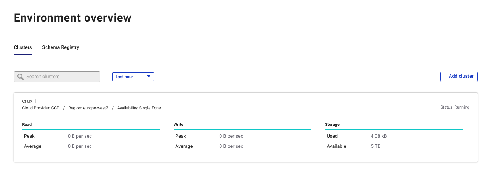
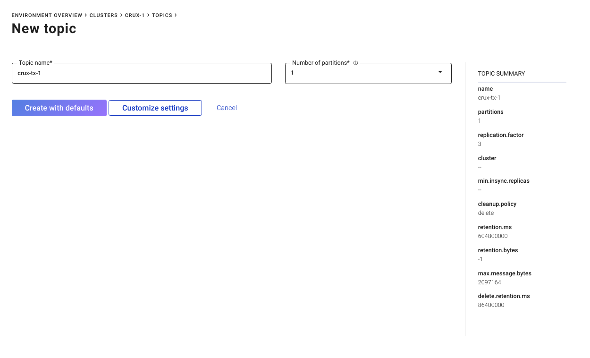

= Use Crux with Confluent's cloud Kafka platform in <5m

Confluent's latest Kafka-as-a-service offering is extremely compelling for
small Crux deployments as there are no minimum fees and the pricing structure
is very simple. `Monthly cost = Data in + Data out + Data retained`. There is
no need to think about brokers or other infrastructure costs. Additionally you
only pay for what you use and there are no upfront costs or termination fees.
The service is currently available in GCP and AWS.

See Confluent's page for pricing details:
https://www.confluent.io/confluent-cloud/

== Setup a Confluent Cloud account

Follow the short sequence of sign-up steps to create an account:
https://www.confluent.io/confluent-cloud/

You will need to provide a valid credit/debit card in order to create an
account.

Login to access your environment dashboard.

== Create a cluster in your default environment

You will need to choose a name (e.g. `crux-1`) cloud provider (e.g. `GCP`) and
region (e.g. `London`).

== Create an API key

Under "Data In/Out > Clients" click "Create Kafka Cluster API key & secret" and
copy the credentials now embedded in the configuration snippet into a `.properties` file
in a safe location that is accessible from your Crux REPL.

== Start a Clojure REPL

`crux-kafka` must be provided. For instance, navigate to `crux-dev` and run
`lein repl`

Update the various values based on your configuration and run the following
code to connect to your cluster and make a transaction:

[source,clj]
----
(require '[crux.api :as crux])
(import (crux.api ICruxAPI))

(def ^crux.api.ICruxAPI node
  (crux/start-node
   {:crux.node/topology :crux.kafka/topology
    :crux.node/kv-store "crux.kv.memdb/kv"
    :crux.kafka/tx-topic "tx-1" ; choose your tx-topic name
    :crux.kafka/doc-topic "doc-1" ; choose your doc-topic name
    :crux.kafka/replication-factor 3 ; Confluent Cloud requires this to be `3`
    :crux.kafka/doc-partitions 6 ; Confluent Cloud default -- you are limited to 2048 partitions per topic for a non-Enterprise cluster
    :crux.kafka/bootstrap-servers "" ; the `bootstrap.servers` value found in your generated properties file
    :crux.kafka/kafka-properties-file "path/to/my-kafka.properties"})) ; the path of your properties file

; you can also use `:kafka-properties-map` although this increases the risk of
; checking-in your SASL secrets!

(def template-kafka-properties-map
  {"ssl.endpoint.identification.algorithm" "https"
   "sasl.mechanism" "PLAIN"
   "request.timeout.ms" "20000"
   "bootstrap.servers" "" ; set to your "url:port" without specifying a protocol
   "retry.backoff.ms" "500"
   "sasl.jaas.config" "org.apache.kafka.common.security.plain.PlainLoginModule required username=\"\" password=\"\";"
   ; note the escaped string characters surrounding your username and password SASL values
   "security.protocol" "SASL_SSL"})

(crux/submit-tx node [[:crux.tx/put {:crux.db/id :my-first-doc :very "cool"}]])

(crux/q (crux/db node) {:find '[e] :where '[[e :crux.db/id _]] :full-results? true})
----

Note that Crux will automatically generate topics with the required
retention/compaction configurations and set the partition number for the
transaction topic to `1`.

You can also create and manage topics independently of Crux using a CLI tool or
the Confluent Cloud web interface, but they will need to be configured
appropriately (see:
https://github.com/juxt/crux/blob/master/crux-kafka/src/crux/kafka.clj).

