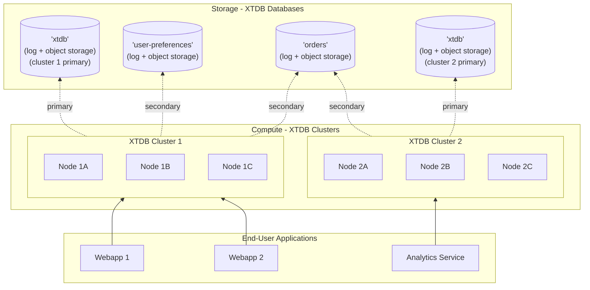

<details>
  <summary>Changelog (last updated v2.1)</summary>
  
v2.1: multi-database support

: XTDB now supports multiple databases within a single XTDB cluster.
  
  Previously, an XTDB cluster only had a single database; XTDB clusters were entirely isolated from each other.
  
  v2.1 added `ATTACH DATABASE` and `DETACH DATABASE` statements.

  
</details>

The term 'database' is very much overloaded in the database world.

In PostgreSQL, a database is a collection of schemas, which are collections of tables. 
In MySQL, a database is synonymous with a schema. 
In SQLite, a database is a single file containing multiple tables.
In MongoDB, a database is a collection of collections.
The SQL specification calls these a 'catalog'.

Given this variance, let's define what this means in XTDB:

- An XTDB database is a collection of tables. 
  Tables may be grouped into 'schemas' - XT has relatively little knowledge of schemas beyond tables optionally having two-part names (`schema.table`).
  
  If the schema is not specified, the default schema is named `public`.
- A single database in XTDB shares a [transaction log](/ops/config/log) and [object storage](/ops/config/storage) with other consumers of that database.
- Multiple XTDB nodes that share a 'primary' database (named `xtdb`) are considered an XTDB 'cluster' - they share a transaction log and object storage for that database.

  This is a logical distinction, because XTDB nodes don't know about each other - there is no communication between them except via the transaction log and object storage.
- XTDB clusters may have any number of attached 'secondary' databases, defined by the log and storage configuration.

  Each database may be safely shared by multiple XTDB clusters, simply by pointing their log and storage configuration to the same underlying resources - **databases (storage) and clusters (compute) are completely decoupled.**
- When you connect to an XTDB node, as part of the connection string, you will specify a database.
  (e.g. in JDBC: `jdbc:xtdb://localhost:5432/my-db`).

  XTDB supports cross-database queries - queries may refer to tables in other databases by using fully-qualified names (e.g. `FROM database.schema.table`). 
  Unqualified tables are assumed to be from the database you connected to.
- Transactions are submitted to one database and may only refer to tables within that database.

  XTDB [guarantees serializability](/about/txs-in-xtdb) within a single database, but not between databases.
  
## What does this mean for me?

This decoupling of databases (storage) and clusters (compute) enables a **data mesh architecture** - organize your databases around business domains (orders, customers, products), while each application team runs their own compute cluster. 
Teams can attach secondary databases to access shared domain data, aligning your data model with your organization's structure while keeping compute independent.



## Database architecture
  
A single database in XTDB consists of the following components:
  


Write-ahead log (WAL)

: shared component responsible for ensuring all the nodes in the cluster agree on a total ordering of transactions within the database. 

  e.g. Kafka

Indexer

: consumes transactions from the log, makes the results available to the query engine.
  
  - at the end of a block (~100k rows/4 hours), the indexer writes the block to the object store.
  - nodes compete to write blocks - although blocks are deterministic, so it doesn't matter who wins.
  - new/restarting nodes start consuming from the most recent block in the object store.
  
Object store

: shared storage for block files.

  e.g. AWS S3, Azure Blob Storage, GCP Cloud Storage

Compactor
: re-sorts/re-partitions block files in the object-store to make them faster to query.

Query engine
: serves queries, reading the object store (via local caches) and recently indexed transactions.
  
For more details on XTDB's storage and its optimisations, check out the ['Building a Bitemporal Index'](https://xtdb.com/blog/building-a-bitemp-index-3-storage) series.

## Attaching/Detaching secondary databases (v2.1+)

Secondary databases are attached to and detached from a cluster by sending transactions to its **primary (`xtdb`) database**.

To attach a database, provide its log and storage configuration in a query to the cluster's primary database, using the [same YAML configuration format](/ops/config) as in your node configuration:

```sql
-- ensured you're connected to the `xtdb` database

-- here we're using dollar-delimited strings for the config 
-- so that we don't have to escape all the single-quotes.

ATTACH DATABASE my_secondary WITH $$
  log: !Local
    path: 'my-secondary-db/log'
  storage: !Local
    path: 'my-secondary-db/storage'
$$
```

If you're using Kafka/S3, for example, you can create a secondary database with another topic on the same Kafka cluster, and either another S3 bucket or another directory within the same bucket:

```sql
-- assuming you've defined the 'my-kafka' cluster in your node configuration

ATTACH DATABASE my_secondary WITH $$
  log: !Kafka
    cluster: 'my-kafka'
    topic: 'xtdb.my-secondary'
    
  storage: !S3
    bucket: 'my-bucket'
    path: 'my-secondary'
$$
```

To detach a database, send `DETACH DATABASE my_secondary`.

<!-- See also: [secondary databases reference](/ops/config/dbs) -->

## Querying multiple databases

Once you've attached secondary databases to your cluster, you can query them either by re-connecting to that database, or by using fully-qualified names in your queries.

This query pulls in data from both the primary database and our previously created secondary database, **within the same query**:

```sql
-- connected to the primary database

SELECT *

-- refer to public.orders table in my_secondary database
FROM my_secondary.orders o 

  -- `users` from the primary database
  JOIN users u ON (o.user_id = u._id)
```

Table names may take any of the following forms:

- `table` - refers to `public.table` in the current database
- `schema.table` - refers to `schema.table` in the current database
- `database.schema.table` - refers to `schema.table` in the specified database
- `database.table` - refers to `public.table` in the specified database

`schema.table` and `database.table` may be ambiguous, of course - if they both exist, an error will be raised.
