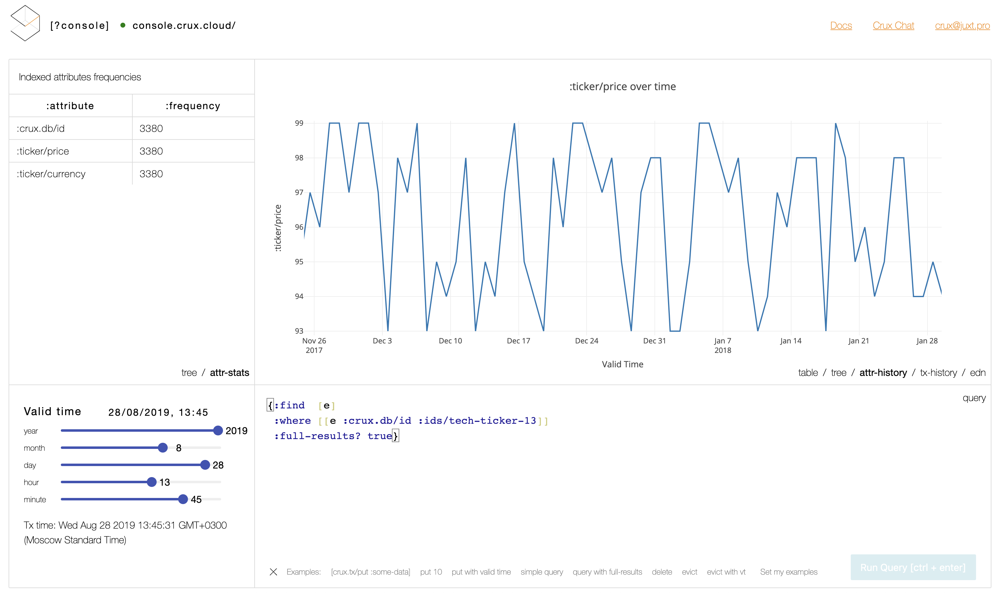

# Crux Console

Console is a web app that gives allows you to query Crux and see data from different perpectives.


It can be used as a standalone analytics tool or as an educational tool.

## Educational use
Console comes with a set of example queries but you can make it load your own
set by providing a url param `examples-gist=gist-raw-url`, like
[here](http://console.crux.cloud/console?examples-gist=https://gist.githubusercontent.com/spacegangster/b68f72e3c81524a71af1f3033ea7507e/raw/5fb55fe8e766245a3338f6e5c508ffbbe824900f/examples.edn)
This way Console will import this file.
Important note : link must point to raw gist content.
Preset queries example:
```clojure
[{:title "Space Stocks"
  :query {:find [e]
          :where [[e :crux.db/id _]]}}
 {:title "Add space stocks"
  :query [[:crux.tx/put {:crux.db/id 33 :title "Company 3"}]]}]
```

## Deployment scenarios
Can be used as an analytics tool
For nginx – the following redirects may be used

```
# in a server block
location /console {                                                                                                                                            
        # don't forget about at least basic auth
        proxy_pass http://localhost:5000;                                                                                                                      
}                                                                                                                                                              
location /crux {                                                                                                                                               
        rewrite ^(/crux)(/.*)$ $2 break;                                                                                                                       
        proxy_pass http://localhost:4889/;
}
```

## How to build or develop

### Prerequisites

All builds require `node` and `yarn` to be installed.

`yarn` is, at the moment, a much better alternative to npm.
Yarn ROI is that in 2-3 uses it will save more time than you spent
installing and learning it, compared to 2-3 runs of npm install.


### Release flow
1. `lein build` will produce you production ready assets
2. `lein build-ebs` does the build above and packs it into
    Elastic Beanstalk package which we upload to AWS to see console.crux.cloud


### Dev flow
To launch development REPL

#### Preferred
```sh
lein cljs-dev  # will install all the node modules, launch cljs compiling guard with code hotswapping
lein repl      # will launch edge rebel repl
```


#### Alternative
```sh
# once
yarn install

dev/shadow-dev &
# will launch shadow-cljs watch build
# it runs a local version

lein repl 
# will launch the server
```


## Sidenotes

#### Plotly
Note that Plotly has its own packaging model (due to heavy weight beneath),
so search for different packages on npm if you need more fine-grained control.
e.g.

- All-in-one https://www.npmjs.com/package/plotly.js-dist

### Datepickers
There are a few things we can look at
- Pikaday
  - looking nice and simple
  - no deps
  - url https://github.com/timgilbert/cljs-pikaday
  - no timepicker, but that's an easier fix

- React datetime picker  
  - demo url http://projects.wojtekmaj.pl/react-datetime-picker/
  - gh url: https://github.com/wojtekmaj/react-datetime-picker
  - good UX, has timepicker
  - claimed test cov 92%
  - seemingly lots of deps :(
  
- Hacker one datepicker
  - demo link: https://reactdatepicker.com
  - gh link: https://github.com/Hacker0x01/react-datepicker/
  - Lots of options, arguable best datepicker-timepicker combination
  - quite heavy :(

Things to be aware of
- YouCanBookMe/react-datetime
  - drags moment.js as a dep
  - UX is questionable

## Potential extension points

### Build
Can be improved with skipping with uberjar build and just updating the jar with

```
jar uf jar-file input-file(s)
```
